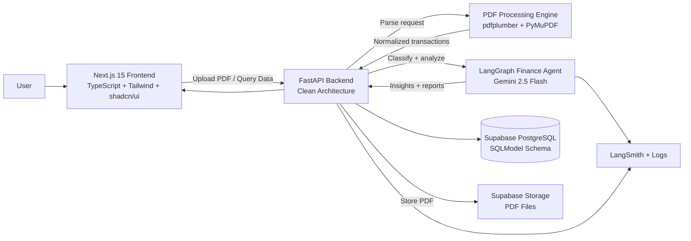
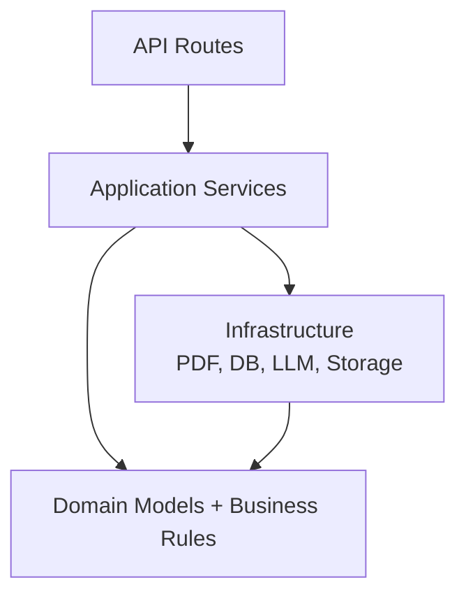
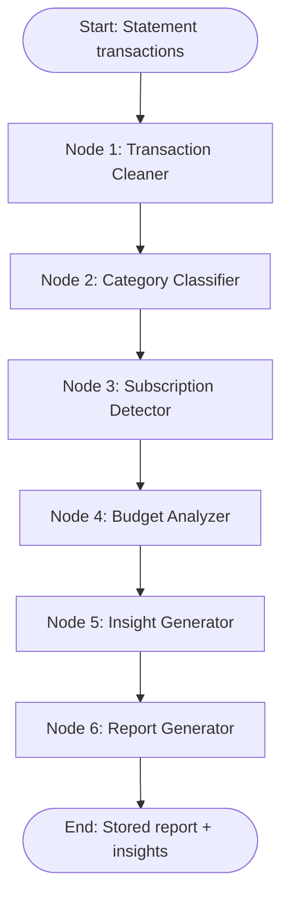

# FinPilot-AI Architecture

## 1. High-Level Architecture Diagram

## 2. Backend Clean Architecture

### What
The system is split into frontend, backend API, PDF parser, AI agent workflow, database, object storage, and observability.

### Why
Financial data systems need traceability, testability, and clear boundaries. PDF parsing, AI reasoning, and financial analytics change at different speeds, so they should be modular.

### How
- Next.js handles user experience and charts.
- FastAPI exposes typed API endpoints.
- SQLModel defines database tables and validation models.
- PDF engine extracts raw rows and normalizes them.
- LangGraph orchestrates AI and analytics nodes.
- Supabase stores relational data and optionally PDF objects.
- LangSmith monitors LLM workflows.

### Alternatives
- **Django instead of FastAPI:** stronger batteries-included admin, less lightweight for AI APIs.
- **Prisma instead of SQLModel:** excellent TypeScript DX, but backend is Python-first.
- **Celery/RQ background jobs immediately:** production-friendly, but extra complexity for early learning.
- **Plaid integration:** better live data, but not free-only and adds compliance complexity.

### Best Practices
- Keep domain logic independent from FastAPI route handlers.
- Store raw extraction output for debugging but redact sensitive logs.
- Use deterministic rules before AI when possible.
- Make each LangGraph node independently testable.
- Add confidence scores and source references for auditability.

## 3. LangGraph Workflow Diagram

## 4. Node Responsibilities

| Node | Responsibility | Mostly Deterministic or AI? |
|---|---|---|
| Transaction Cleaner | Normalize descriptions, dates, amounts, signs | Deterministic |
| Category Classifier | Map transactions to category taxonomy | Hybrid rules + AI |
| Subscription Detector | Detect recurrence and subscription candidates | Deterministic analytics |
| Budget Analyzer | Compare spending to budgets and history | Deterministic analytics |
| Insight Generator | Produce plain-English explanations | AI grounded by calculations |
| Report Generator | Compile structured monthly report | Hybrid |

## 5. Phase 1 Concept Check

1. Why should PDF parsing not live directly inside API route handlers?
2. Which LangGraph nodes should be easiest to unit test without an LLM?
3. What data should be passed to the LLM, and what should stay private?

## 6. Exercises

1. Add a future background worker to the architecture diagram.
2. Draw how the system changes if Plaid is added later.
3. Identify three places where retries should be implemented.
