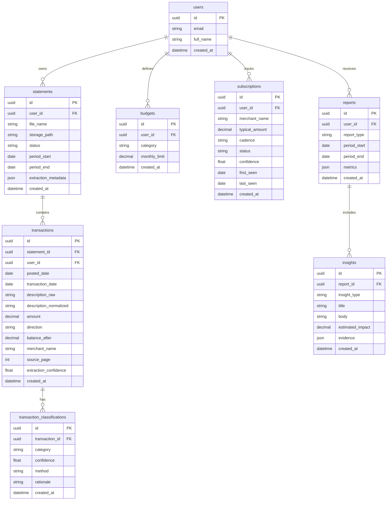

# FinPilot-AI Database Design

## 1. Entity Relationship Diagram

## 2. Core Design Decisions

### Users
**What:** Represents the account owner.

**Why:** Even if authentication is simple in early development, every financial record should be scoped to a user from day one.

**How:** Supabase Auth can own authentication while the application keeps a profile row keyed by user ID.

**Alternatives:** A single-user local app could skip users, but that makes production migration harder.

**Best Practices:** Enforce row-level security in Supabase before real users upload statements.

### Statements
**What:** Metadata for each uploaded PDF statement.

**Why:** A statement is the audit boundary for extraction, reprocessing, and troubleshooting.

**How:** Store file metadata, processing status, statement period, and extraction metadata.

**Alternatives:** Store only transactions, but then source traceability is weak.

**Best Practices:** Make processing idempotent by statement ID.

### Transactions
**What:** Normalized financial events extracted from statements.

**Why:** Transactions are the foundation for categorization, subscriptions, trends, and chat grounding.

**How:** Keep raw and normalized descriptions, signed amount, direction, merchant, source page, and confidence.

**Alternatives:** Store debit and credit as separate columns. A signed amount is simpler for analytics, while direction preserves statement semantics.

**Best Practices:** Use decimal types for money, never floating point.

### Classifications
**What:** Category assignment history for transactions.

**Why:** AI output should be auditable and replaceable without overwriting the original transaction.

**How:** Store category, confidence, method, and rationale.

**Alternatives:** Put category directly on transactions. Simpler, but loses history and model comparison.

**Best Practices:** Track whether classification came from a rule, LLM, or user override.

### Subscriptions
**What:** Recurring payment candidates and confirmed subscriptions.

**Why:** Subscriptions are user-facing insights, not just raw transactions.

**How:** Store merchant, cadence, typical amount, status, confidence, and first/last seen dates.

**Alternatives:** Compute subscriptions on every request. This avoids stale data but is slower and harder to audit.

**Best Practices:** Recompute after new statements and preserve status changes.

### Reports and Insights
**What:** Generated summaries and evidence-backed recommendations.

**Why:** Reports provide stable snapshots users can revisit and chat can reference.

**How:** Store aggregate metrics as JSON and individual insights with evidence.

**Alternatives:** Generate reports dynamically. This reduces storage but can produce inconsistent historical results.

**Best Practices:** Store evidence IDs so every insight can be traced back to transactions.

## 3. Indexing Plan

| Table | Index | Purpose |
|---|---|---|
| statements | `(user_id, created_at)` | Recent uploads |
| transactions | `(user_id, posted_date)` | Time-window analytics |
| transactions | `(user_id, merchant_name)` | Merchant summaries |
| classifications | `(transaction_id, created_at)` | Latest classification |
| subscriptions | `(user_id, status)` | Subscription dashboard |
| reports | `(user_id, period_start, period_end)` | Report lookup |

## 4. Phase 1 Concept Check

1. Why should money be stored as decimal instead of float?
2. Why keep raw descriptions after normalization?
3. Why are classifications separate from transactions?

## 5. Exercises

1. Add a `user_overrides` table for manually corrected categories.
2. Design a migration strategy if category names change later.
3. Decide what fields should be encrypted or excluded from logs.
